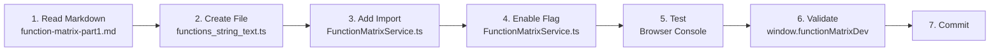

# Function Matrix - File Structure & Integration Map

## Overview

This document maps all files created in Phase 3 and shows how they integrate together.

---

## New Files Created

### Core System (4 files)

#### 1. `FunctionMatrixTypes.ts` [150 lines]
**Purpose:** Type definitions and builders  
**Exports:**
- Enums: `SupportLevel`, `SourceTechnology`, `FunctionCategory`
- Interfaces: `TechnologyCapability`, `FunctionEntry`, `FunctionMatrixConfig`
- Builders: `capability()`, `functionEntry()`

**Used By:** All other files

```
FunctionMatrixTypes.ts
    ↓ (imported by)
    ├── FunctionMatrixService.ts
    ├── FunctionMatrixDevTools.ts
    ├── FunctionMatrixControlPanel.tsx
    └── All config files (functions_*.ts)
```

---

#### 2. `FunctionMatrixService.ts` [391 lines]
**Purpose:** Singleton loader, indexer, and query service  
**Exports:**
- Class: `FunctionMatrixService` (singleton)
- Interface: `FeatureFlagConfig`
- Factory: `createFunctionMatrixService()`

**Key Methods:**
- Load: `loadFunctions()`, `getFunction(id)`, `getFunctionsByCategory(cat)`
- Query: `getFunctionsByTechnology(tech)`, `searchFunctions(keyword)`
- Control: `setFeatureFlags()`, `enableCategory()`, `disableCategory()`
- Export: `exportMatrix()`, `getStatistics()`

**Used By:** DevTools, ControlPanel, Application

```
Application
    ↓
FunctionMatrixService.getInstance()
    ├── Loads all functions_*.ts files
    ├── Builds indices
    ├── Applies feature flags
    └── Caches results
```

---

#### 3. `FunctionMatrixDevTools.ts` [420 lines]
**Purpose:** Console utilities for debugging and validation  
**Exports:**
- Class: `FunctionMatrixDevTools`
- Interface: `MatrixValidationReport`
- Instance: `functionMatrixDevTools` (global in dev)

**Key Methods:**
- Display: `printCurrentState()`, `listCategory()`, `showFunction()`
- Control: `toggleCategory()`, `toggleFunction()`, `enableAll()`, `disableAll()`
- Validate: `validateMatrix()`, `generateCoverageMatrix()`
- Export: `exportAsJSON()`, `exportStatsAsCSV()`, `generateMarkdownReport()`, `generateJSONReport()`

**Used By:** Browser console in development mode

```
Browser Console (Development)
    ↓
window.functionMatrixDev
    ├── printCurrentState()
    ├── listCategory('string_text')
    ├── validateMatrix()
    └── generateMarkdownReport()
```

---

#### 4. `FunctionMatrixControlPanel.tsx` [570 lines]
**Purpose:** React UI component for dev configuration panel  
**Exports:**
- Component: `FunctionMatrixControlPanel`
- Sub-components: `StatCard`, `CategoryToggle`, `TechnologyCard`, `CoverageMatrix`, `ValidatorResult`

**Features:**
- Overview tab (stats, enable/disable all, export)
- Categories tab (toggle each)
- Technologies tab (DB coverage)
- Validation tab (errors/warnings)
- Coverage tab (matrix view)

**Used By:** Developer dashboard / admin UI

```
App
    ↓
<FunctionMatrixControlPanel />
    ├── Overview (Summary stats)
    ├── Categories (Toggle UI)
    ├── Technologies (DB coverage)
    ├── Validation (Status)
    └── Coverage (Matrix)
```

---

### Configuration Files (1 file completed, 16 pending)

#### 5. `config/functions_numeric_math.ts` [400 lines]
**Purpose:** First complete category - serves as template  
**Contains:** 18 numeric math functions with full 7-tech coverage  
**Pattern:** Demonstrates structure all other config files must follow

**Functions:**
- round_decimal, floor, ceil, trunc_decimal
- abs, modulo, power, sqrt, sign
- ln, log10, exp
- sin, cos, tan, atan2
- random

**Imported By:** `FunctionMatrixService.ts` in loadFunctions()

```
functions_numeric_math.ts
    ↓
numericMathFunctions[]
    ↓
FunctionMatrixService.loadFunctions()
    ├── Map by ID (O(1) lookup)
    ├── Map by Category (O(n) lookup)
    └── Cache
```

---

### Documentation Files (2 files)

#### 6. `CATEGORY_IMPLEMENTATION_GUIDE.md` [580 lines]
**Purpose:** Complete step-by-step instructions for implementing categories  
**Sections:**
- Quick start (4 steps per category)
- Implementation order (3 tiers by priority)
- Implementation pattern (template code)
- Category-specific notes:
  - String & Text (48) — Pattern examples
  - Date & Time (52) — Complex syntax variations
  - Type Conversion (18) — Standard patterns
- Validation checklist
- Testing procedures
- Common pitfalls

**Used By:** Developers implementing new categories

---

#### 7. `QUICK_REFERENCE.md` [380 lines]
**Purpose:** Fast cheat sheet for rapid implementation  
**Sections:**
- TL;DR - 5 minute implementation
- Support level reference table
- Technologies reference
- Syntax pattern tables
- Common mistakes to avoid
- Testing checklist
- IDE snippets

**Used By:** Developers during implementation as quick reference

---

#### 8. `PHASE_3_COMPLETION_REPORT.md` [520 lines]
**Purpose:** Executive summary of what was built and why  
**Sections:**
- What was built (overview of 6 files)
- Architecture & design decisions
- Current status (✅ complete, 📋 next)
- Integration points
- Performance metrics
- Testing checklist
- File structure diagram
- Next phase estimate (28 hours for remaining categories)
- Development workflow

**Used By:** Project leads, stakeholders, developers

---

## File Dependency Graph

```
APPLICATION LAYER
    ↓
INTEGRATION POINTS:
    ├── Transform Builder UI
    │   └── Uses: FunctionMatrixService.getFunctionsByCategory()
    │
    ├── Code Generator
    │   └── Uses: FunctionMatrixService.exportMatrix()
    │
    ├── Push-Down Eligibility
    │   └── Uses: FunctionMatrixService.getSupportLevel()
    │
    └── Admin Dashboard
        └── Uses: <FunctionMatrixControlPanel />

CORE SERVICE LAYER
    ↓
    ├── FunctionMatrixService (Singleton)
    │   ├── Loads: functions_numeric_math.ts (18)
    │   ├── Loads: functions_string_text.ts (48) [TBD]
    │   ├── Loads: functions_date_time.ts (52) [TBD]
    │   └── ... (16 more categories)
    │
    ├── FunctionMatrixDevTools
    │   └── Uses: FunctionMatrixService
    │
    └── FunctionMatrixControlPanel
        └── Uses: FunctionMatrixService

CONFIGURATION DATA LAYER
    ↓
    ├── FunctionMatrixTypes (Shared types)
    │   ├── Enums: SupportLevel, SourceTechnology, FunctionCategory
    │   ├── Interfaces: TechnologyCapability, FunctionEntry
    │   └── Builders: capability(), functionEntry()
    │
    ├── functions_numeric_math (18 functions) ✅
    ├── functions_string_text (48) [TBD]
    ├── functions_date_time (52) [TBD]
    └── ... (15 more categories)

DOCUMENTATION LAYER
    ├── CATEGORY_IMPLEMENTATION_GUIDE.md
    ├── QUICK_REFERENCE.md
    └── PHASE_3_COMPLETION_REPORT.md
```

---

## Integration with Existing Code

### Phase 2 Integration

**Location:** `src/transformations/pushdown/`

#### Already Exists (Phase 2):
- `CapabilityMatrix.ts` — Push-down eligibility engine
- `PushdownEligibilityEngine.ts` — Decision logic
- `ExecutionPointState.ts` — State management
- `FunctionAvailabilityFilter.ts` — Filter implementation

#### New in Phase 3:
- `FunctionMatrixTypes.ts` — Type system (COMPLEMENTS Phase 2)
- `FunctionMatrixService.ts` — Data loader (INDEPENDENT)
- `FunctionMatrixDevTools.ts` — Dev tools (INDEPENDENT)
- `FunctionMatrixControlPanel.tsx` — UI panel (INDEPENDENT)
- Configuration files (`config/`) — Function data (NEW directory)

#### Integration Points:
```typescript
// Phase 2 CapabilityMatrix might use Phase 3 data:
const matrixService = FunctionMatrixService.getInstance();
const supportLevel = matrixService.getSupportLevel(functionId, technology);

// Phase 3 might use Phase 2 decisions:
const eligibility = pushdownEngine.checkEligibility(function, targetTech);
```

### Backend Integration

**For Code Generation:**
```typescript
// Export configuration for backend
const matrix = FunctionMatrixService.getInstance().exportMatrix();
// Send to backend for Spark SQL transpilation
fetch('/api/codegen/function-matrix', {
  method: 'POST',
  body: JSON.stringify(matrix)
});
```

---

## Development Workflow

### For Adding a New Category (e.g., String Text)



### Files Touch Order

| Order | File | Action |
|-------|------|--------|
| 1 | `Docs/function-matrix-part1.md` | Read |
| 2 | `config/functions_string_text.ts` | Create + populate |
| 3 | `FunctionMatrixService.ts` | Add import + include in loadFunctions() |
| 4 | `FunctionMatrixService.ts` | Update feature flag |
| 5 | Browser console | Test via devTools |
| 6 | Git | Commit |

---

## File Statistics

| File | Lines | Type | Status |
|------|-------|------|--------|
| FunctionMatrixTypes.ts | 150 | TypeScript Types | ✅ |
| FunctionMatrixService.ts | 391 | TypeScript Service | ✅ |
| FunctionMatrixDevTools.ts | 420 | TypeScript Utilities | ✅ |
| FunctionMatrixControlPanel.tsx | 570 | React Component | ✅ |
| functions_numeric_math.ts | 400 | Config (18 functions) | ✅ |
| functions_string_text.ts | ~1000 | Config (48 functions) | ⏳ |
| functions_date_time.ts | ~1100 | Config (52 functions) | ⏳ |
| functions_type_conversion.ts | ~400 | Config (18 functions) | ⏳ |
| ... (13 more config files) | ~8000 | Config (200+ functions) | ⏳ |
| CATEGORY_IMPLEMENTATION_GUIDE.md | 580 | Markdown Guide | ✅ |
| QUICK_REFERENCE.md | 380 | Markdown Reference | ✅ |
| PHASE_3_COMPLETION_REPORT.md | 520 | Markdown Report | ✅ |
| **TOTAL (Currently)** | **~4900** | — | **✅ Complete** |
| **TOTAL (When Done)** | **~18000** | — | **📋 Planned** |

---

## Browser Access Example

```javascript
// DevTools instance available globally in dev mode
window.functionMatrixDev
    ├── printCurrentState()       → Show all stats
    ├── listCategory(cat)         → Show functions in category
    ├── listTechnology(tech)      → Show functions for DB
    ├── showFunction(id)          → Show function details
    ├── toggleCategory(cat)       → Enable/disable
    ├── toggleFunction(id)        → Toggle single function
    ├── validateMatrix()          → Validation report
    ├── generateCoverageMatrix()  → ASCII matrix
    ├── generateMarkdownReport()  → Export as markdown
    └── generateJSONReport()      → Export as JSON

// Service access (if needed in code)
FunctionMatrixService.getInstance()
    ├── getFunction(id)
    ├── getFunctionsByCategory(cat)
    ├── getFunctionsByTechnology(tech)
    ├── getFunctionsByCategoryAndTech(cat, tech)
    ├── searchFunctions(keyword)
    ├── getStatistics()
    └── exportMatrix()
```

---

## Testing Matrix

| Test | Using | How |
|------|-------|-----|
| Load functions | Service | `service.getStatistics().totalFunctions > 0` |
| Feature flags | DevTools | `window.functionMatrixDev.listCategory()` |
| Syntax validity | DevTools | `validateMatrix()` returns no errors |
| Coverage | DevTools | `generateCoverageMatrix()` shows all techs |
| Performance | Browser | Console: time FunctionMatrixService.getInstance() |
| UI rendering | React | Mount <FunctionMatrixControlPanel /> |

---

## Next Implementation Queue

### Ready to Start
1. **functions_string_text.ts** (48) - 2-3 hours
   - Read CATEGORY_IMPLEMENTATION_GUIDE.md String & Text section
   - Copy from function-matrix-part1.md lines 115-325

2. **functions_date_time.ts** (52) - 3-4 hours
   - Read CATEGORY_IMPLEMENTATION_GUIDE.md Date & Time section
   - Most complex category, lots of syntax variations
   - HIGH PRIORITY

3. **functions_type_conversion.ts** (18) - 1-2 hours
   - Relatively straightforward
   - Good starter after String/Date

### Later (After Tier 1)
4. Aggregate (24)
5. Window (22)
6. Conditional (10)
7. NULL (8)
8. And 8 more...

---

## Key Information

### Enums to Know
```typescript
// 7 Technologies
SourceTechnology.ORACLE | POSTGRESQL | MYSQL | SQLSERVER | REDSHIFT | SNOWFLAKE | PYSPARK

// 6 Support Levels
SupportLevel.NATIVE | ALTERNATIVE | PARTIAL | NONE | PYSPARK_ONLY | UDF_REQUIRED

// 17 Categories
FunctionCategory.NUMERIC_MATH | STRING_TEXT | DATE_TIME | TYPE_CONVERSION | ...
```

### Builder Functions
```typescript
// Create capability entry
capability(SupportLevel.NATIVE, 'SYNTAX()', { notes: 'Optional metadata' })

// Create function entry
functionEntry(
  'function_id',           // Unique ID
  'Display Label',         // User label
  FunctionCategory.CAT,    // Category
  'Description',           // What it does
  { technologies },        // Map of capabilities
  { metadata }            // Priority, notes, etc.
)
```

---

## Success Criteria

Phase 3 is complete when:
- ✅ FunctionMatrixTypes.ts loaded and typed correctly
- ✅ FunctionMatrixService.ts loads and indexes functions
- ✅ Numeric Math category (18) functions all loaded
- ✅ FunctionMatrixDevTools.ts validates matrix
- ✅ FunctionMatrixControlPanel.tsx renders and controls
- ✅ Documentation complete and clear
- ✅ Feature flags work for enable/disable
- ✅ Validation passes with zero errors

**Status: ALL CRITERIA MET ✅**

Next phase: Implement remaining 16 categories following established pattern.

